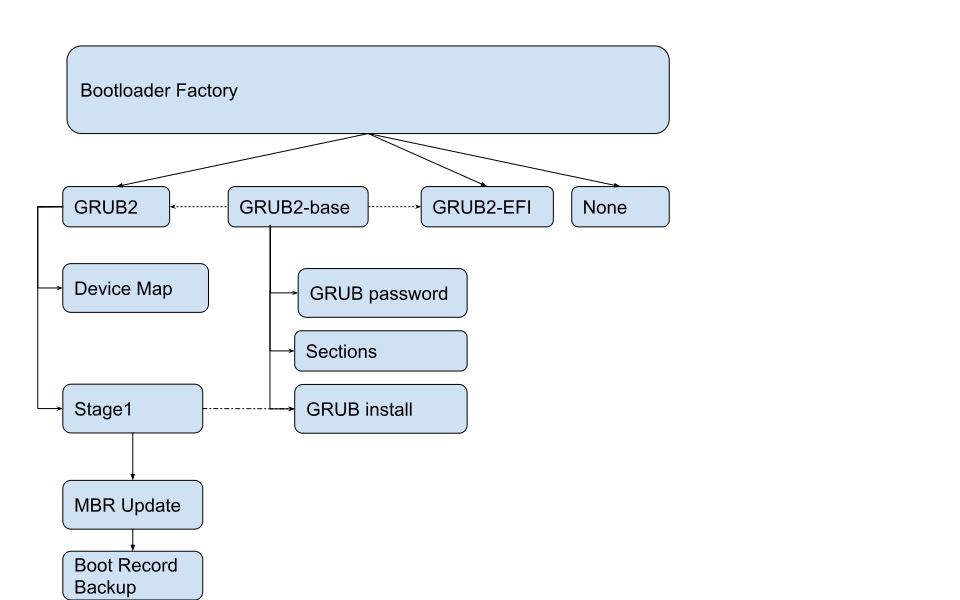

# YaST - The Bootloader Module #

## Goal

This module has two main responsibilities:

1. Proposing a bootable configuration so even beginners who've never heard about
   booting can get a bootable distribution out of the box without any interaction.

2. Letting advanced users who already know what they want to achieve
   to edit an existing configuration or a proposal.

Check our list of [supported scenarios.](SUPPORTED_SCENARIOS.md)

## Development

### High Level Overview

The bootloader module consists of two more or less separated components.
The **UI** including dialogs, widgets and similar, and
the **backend** that is responsible for reading, writing, proposing.

### Backend

To get to the clickable links in the image, right-click the diagram and choose "Display Image" (Firefox) or "Open Image in New Tab" (Chromium).

The entry point to the backend is the [bootloader factory](https://www.rubydoc.info/github/yast/yast-bootloader/master/Bootloader/BootloaderFactory),
that holds and also can propose the bootloader implementation. So now let's explain each component of the picture:

- [GRUB2](https://www.rubydoc.info/github/yast/yast-bootloader/master/Bootloader/Grub2) for legacy booting or emulated grub2 boot like s390x.
- [GRUB2-EFI](https://www.rubydoc.info/github/yast/yast-bootloader/master/Bootloader/Grub2EFI) for EFI variant of GRUB2 bootloader
- [systemd-boot](https://www.rubydoc.info/github/yast/yast-bootloader/master/Bootloader/SystemdBoot) systemd bootloader (for EFI only)
- [None](https://www.rubydoc.info/github/yast/yast-bootloader/master/Bootloader/NoneBootloader) when YaST does not manage booting
- [GRUB2 base](https://www.rubydoc.info/github/yast/yast-bootloader/master/Bootloader/Grub2Base) is the shared functionality for both GRUB2 implementations
- [GRUB password](https://www.rubydoc.info/github/yast/yast-bootloader/master/Bootloader/GRUB2Pwd) is a specific class that manages password protection of grub2
- [Sections](https://www.rubydoc.info/github/yast/yast-bootloader/master/Bootloader/Sections) is a component responsible for getting info about generated grub2 sections and what the default section for booting is
- [GRUB2 install](https://www.rubydoc.info/github/yast/yast-bootloader/master/Bootloader/GrubInstall) is responsible for calling the `grub2-install` script with correct arguments. For legacy booting it gets target stage1 devices.
- [Device Map](https://www.rubydoc.info/github/yast/yast-bootloader/master/Bootloader/DeviceMap) is a component responsible for managing the mapping between grub device names and kernel/udev names.
- [Stage1](https://www.rubydoc.info/github/yast/yast-bootloader/master/Bootloader/Stage1) holds information about stage1 location for grub2, also whether a generic MBR is needed and whether a partition should be activated.
- [MBR Update](https://www.rubydoc.info/github/yast/yast-bootloader/master/Bootloader/MBRUpdate) is responsible for generic MBR and stage1 if needed
- [Boot Record backup](https://www.rubydoc.info/github/yast/yast-bootloader/master/Bootloader/BootRecordBackup) creates a backup of boot record for devices which the code touched
- [Serial Console](https://www.rubydoc.info/github/yast/yast-bootloader/master/Bootloader/SerialConsole) converts between grub2 serial console configuration and kernel serial console configuration
- [Sysconfig](https://www.rubydoc.info/github/yast/yast-bootloader/master/Bootloader/Sysconfig) read/write sysconfig configuration for bootloader. Sysconfig basically holds currently used grub2 implementation and configuration that is not in grub2 itself like if use secure boot or trusted grub

### See Also

The bootloader module uses CFA (config files API) module for GRUB2 - [See CFA for GRUB2 repository](https://github.com/config-files-api/config_files_api_grub2)
